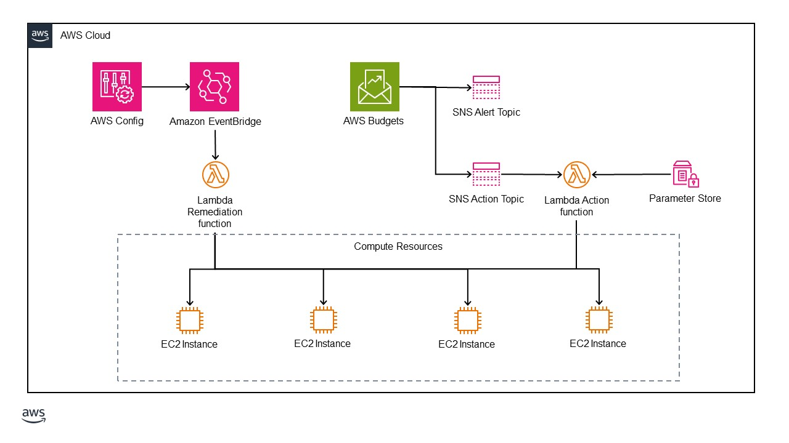

# Budget Controls for AWS

This solution is intended to help new AWS customers control their spend as they learn about AWS services.  It is deployed into a single AWS account, and runs within the single AWS region where it is deployed.  An AWS CloudFormation template configures several services that will create a budget for a user-defined amount.  It will send alerts when that budget is nearing exhaustion.  Finally, it will take user-defined action against several compute resources when the budget is about to be met.  Storage, networking, and other services are not affected. Currently, this solution supports the following compute resources:

- EC2 instances

## Architecture

This solution configures several AWS services.  An AWS Config rule is enabled to look for a specific resource tag.  If it is not found, or if the values for that tag are not valid, a Remediation Lambda function is triggered and creates a tag for that resource with the default value.  An AWS Budget is created for the amount specified at deployment.  Messages are sent to an SNS alert topic when the budget hits 80%.  A message is sent to an SNS action topic when the budget hits 90%.  An Action Lambda function is subscribed to this topic and takes the action that is specified in the required tag.

## Deployment

### Prerequisites

Before the solution can be deployed, prepare the followings in your AWS account:

- Enable AWS Config for your account.
- Create or reuse an S3 bucket to store the deployment assets.

### Steps

Upload the contents of this repository to the S3 bucket. You can place the files at the top level of the bucket, or place them within a folder.  If you add them to a folder, you will need to specify this complete "path" as the key for the Lambda function .zip archives.

Next, open the [AWS CloudFormation console](https://console.aws.amazon.com/cloudformation/home?#/stacks/). Create a stack with new resources.  Choose an existing teplate, provide the S3 URL, and click "Next." 

It will ask for the following parameters:

   | Variable Name          | Meaning                                                      | Example                              |
   | ---------------------- | ------------------------------------------------------------ | ------------------------------------ |
   | Stack Name             | The name of the CloudFormation stack.                        | BudgetControl                        |
   | AdminEmail             | Email address for the admin.                                 | john_doe@example.com                 |
   | S3DeploymentBucketName | Name of an existing S3 bucket to deployment assets.          | amzn-s3-demo-source-bucket           |
   | ActionLambdaKey        | The path of the Action lambda zip file.                      | BC-Action-lambda.zip                 |
   | RemediationLambdaKey   | The path of the Remediation lambda zip file.                 | BC-Remediation-lambda.zip            |
   | BudgetAmount           | The total budget amount per month (without the $).           | 500.00                               |

The solution will take about five minutes to deploy.  It will send an email to the provided address, asking for verification for subscription to the SNS topic.

## Usage

Budget Controls for AWS uses resource tags to take specified actions on covered compute resources when the monthly budget is near exhaustion.  When a covered resource is missing the required tag, a remediation action is triggered.  It adds a tag named "BudgetControlAction" and sets the value to "Inform."  In this state, nothing will happen when the budget is exhausted.  If the value is changed to "Stop" the compute resource will be stopped.  This means that compute will cease, but it can be later restarted.  The resource will continue to accrue local storage costs.  If the value is changed to "Terminate" the compute resource will be terminated.  Not only will the compute cease, but the attached storage will also be deleted.  Note, this does not affect file systems or other storage resources that the compute resource may only be accessing.

### Default Behavior

By default, an e-mail alert will be sent when 80% of the budget is exhausted.  At 90%, the actions will be triggered.  The actions are triggered at 90% because storage, networking, database, and other resources will continue to accrue costs.  These threshold values are fully configurable.

### Reconfiguring values

The monthly budget amount can be changed as needed.  If the value is changed, the thresholds will be immediately reevaluated.  Note, if the new value is lower, it could trigger the actions to execute.

More e-mail recipients can be subscribed to the SNS topic.

To change the Action, the tags on the resource must be modified.  These tags can be modified within the console for the specific service, such as EC2.  Or, they can be modified using the [Tag Editor](https://console.aws.amazon.com/resource-groups/tag-editor/).  

## Limitations

The solution runs in a single account, and is deployed into a single region.  If resources are created in a second or multiple regions, the Budget Control solution must also be deployed into those regions.

The AWS Config rule that detects missing BudgetControlAction tags or invalid values for those tags is only triggered on configuration changes.  If there are resources already provisioned in the AWS account before the Budget Control solution is deployed, it will not assess these resources until the next time they have a configuration change.  It is configured this way to keep costs down.  The AWS Config rule is "detective" and may take a few minutes to trigger remediation of the missing or invalid tag.

It is important to note that the Budget Controls for AWS solution will not prevent resources from being restarted or created after the Budget has been exceeded and the actions triggered.  The action Lambda function is only triggered once, and then an e-mail is sent to the administrator notifying them of the actions that were taken.

### Clean Up

To remove the Budget Controls for AWS solution, simply delete the CloudFormation stack in the AWS console.  The "BudgetControlAction" tags can be removed from resources manually, if desired.  Once the stack is deleted, the tags will not affect the resource.

Each Lambda function creates logs within CloudWatch.  These logs persist after the solution is deleted.  They can be deleted manually, or retained as needed.

## Security

See [CONTRIBUTING](CONTRIBUTING.md#security-issue-notifications) for more information.

## License

This library is licensed under the Apache 2.0 License. See the [LICENSE](LICENSE) file.