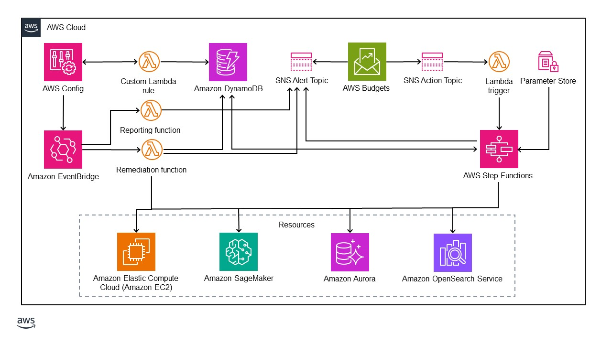

# Budget Controls for AWS

This solution is intended to help new AWS customers control their spend as they learn about AWS services.  It is deployed into a single AWS account, and runs within the single AWS region where it is deployed.  An AWS CloudFormation template configures several services that will create a budget for a user-defined amount.  It will send alerts when that budget is nearing exhaustion.  Finally, it will take user-defined action against several compute resources when the budget is about to be met.  Storage, networking, and other services are not affected. Currently, this solution supports the following compute resources:

- EC2 instances
- SageMaker noteboook instances and domains
- OpenSearch domains
- RDS Aurora clusters

## Architecture

This solution configures several AWS services.  An AWS Config rule is enabled to look for a specific resource tag.  If it is not found, or if the values for that tag are not valid, a Remediation Lambda function is triggered and creates a tag for that resource with the default value.  These resources are logged in a Dynamo DB table, and an email is sent to notify the admin of the resource and its current tag value.  An AWS Budget is created for the amount specified at deployment.  Messages are sent to an SNS alert topic when the budget hits 80%.  A message is sent to an SNS action topic when the budget hits 90%.  A Lambda function that is subscribed to this topic executes a Step Function to take the actions that are specified in the tag.  The Step Function will reevaluate the resources one more time to ensure the most current tag values are recorded.  Then actions are taken by the Step Function according to the tag value.  Once completed, a report of all actions taken are then sent via email.

## Deployment

### Prerequisites

Before the solution can be deployed, prepare the following in your AWS account:

- Enable AWS Config for your account.

### Steps

Download the CloudFormatin template in this repository, budgetcontrol_resources.yaml, to your local computer.  Next, open the [AWS CloudFormation console](https://console.aws.amazon.com/cloudformation/home?#/stacks/). Create a stack with new resources.  Upload the teplate, and click "Next." 

It will ask for the following parameters:

   | Variable Name          | Meaning                                                      | Example                              |
   | ---------------------- | ------------------------------------------------------------ | ------------------------------------ |
   | Stack Name             | The name of the CloudFormation stack.                        | BudgetControl                        |
   | AdminEmail             | Email address for the admin.                                 | john_doe@example.com                 |
   | BudgetAmount           | The total budget amount per month (without the $).           | 500.00                               |

The solution will take less than five minutes to deploy.  It will send an email to the provided address, asking for verification for subscription to the SNS topic.  You must click the verify link or emails will not be delivered to the admin e-mail address.

## Usage

Budget Controls for AWS uses resource tags to take specified actions on supported resources when the monthly budget is near exhaustion.  When a supported resource is missing the required tag, a remediation action is triggered.  It adds a tag named "BudgetControlAction" and sets the value to "Inform."  When set to this value, nothing will happen to the resource when the budget is exhausted.  If the value is set to "Stop" the resource will be stopped when the budget is exhausted.  This means that the resource will cease providing service, but it can be later restarted.  The resource will continue to accrue any local storage costs as normal.  If the value is set to "Terminate" the resource will be deleted when the budget is exhausted.  **NOTE:**  this is a permanent and irreversible action!  Not only will the resource cease to provide service, but the attached storage will also be deleted.  Note, this does not affect file systems or other storage resources that the resource may be accessing.

### Default Behavior

By default, an e-mail alert will be sent when 80% of the budget is exhausted.  At 90%, the actions will be triggered.  The actions are triggered at 90% because storage, networking, database, and other resources will continue to accrue costs.  These threshold values are fully configurable after the solution has been deployed.

### Reconfiguring values

The monthly budget amount can be changed as needed.  If the value is changed, the thresholds will be immediately reevaluated.  Note, if the new value is lower, it could trigger the actions to execute.

More e-mail recipients can be subscribed to the SNS topic.

To change the Action, the tags on the resource must be modified.  These tags can be modified within the console for the specific service, such as EC2.  Or, they can be modified using the [Tag Editor](https://console.aws.amazon.com/resource-groups/tag-editor/).  The Tag Editor makes it very easy to evaluate and modify the tags on several resources at once.  Simply search for the tag "BudgetControlAction" for all resource types.  It will list the resources with this tag, and they can be edited as desired.

As published, the remediation action can only add the value of "Inform" to the "BudgetControlAction" tag.  If you would like to use a different default value (e.g. have your resources "Stop" by default) the solution will need to be modified.  First, you will need to modify the "awsconfigNonCompliantResourceActionlambda" role, and edit the attached "ServiceRoleDefaultPolicy" policy document.  Edit the list of valid tags to include "Stop" and/or "Terminate" as suits your needs.  Then, go to the Systems Manager console, and select the Parameter Store.  Edit the parameter "ServiceActionMappingParameter" and change the value for your resource type (e.g. "AWS::EC2::Instance" or "AWS::SageMaker::NotebookInstance") from "Inform" to "Stop" or "Terminate".  You may only use a single value here.  Once these changes are made, newly created or modified resources will have these tag values applied.  **NOTE:**  If you change the default value to "Terminate," this is a descructive and permanent action!  Only use "Terminate" on resources that you want to permanently remove when your budget is exceeded.

## Auditing

There are two DynamoDB tables created for the solution.  The table with "AuditResouceInfoDefaultTag" in the name contains a list of resources that are being tracked by the solution.  There is no need to update this table.  The table with "AuditResouceInfoActionStatus" in the name contains a historic list of actions taken on those resources when the Budget is consumed.  Items in this table persist until deleted by an administrator, and can be reviewed over time.

## Limitations

The solution runs in a single account, and is deployed into a single region.  If resources are created in a second or multiple regions, the Budget Controls for AWS solution must also be deployed into those regions.

The AWS Config rule that detects missing BudgetControlAction tags or invalid values for those tags is only triggered on configuration changes.  If there are resources already provisioned in the AWS account before the Budget Control solution is deployed, it may not assess these resources until the next time they have a configuration change.  It is configured this way to keep costs down.  The AWS Config rule is "detective" and may take a few minutes to trigger remediation of the missing or invalid tag.

OpenSearch Domains can only use the BudgetControlAction tag values "Inform" and "Terminate."  The resource cannot be stopped.  While the tag value of "Stop" is generally valid, it will not trigger any action on this resource type.

It is important to note that the Budget Controls for AWS solution will not prevent resources from being restarted or created after the Budget has been exceeded and the actions triggered.  The action Lambda function is only triggered once, and then an e-mail is sent to the administrator notifying them of the actions that were taken.

### Clean Up

To remove the Budget Controls for AWS solution, simply delete the CloudFormation stack in the AWS console.  The "BudgetControlAction" tags will remain in place, but can be removed from resources manually, if desired.  Once the stack is deleted, the tags will not affect the resource.

Each Lambda and Step Function creates logs within CloudWatch.  These logs persist after the solution is deleted.  They can be deleted manually or retained as needed.

Before RDS Aurora clusters are deleted, a final snapshot is taken.  The snapshot name will be a combination of the cluster name and the  suffix "-bc-final."  These snapshots persist after the solution is deleted.  They can be deleted manually or retained as needed.

## Security

See [CONTRIBUTING](CONTRIBUTING.md#security-issue-notifications) for more information.

## License

This library is licensed under the Apache 2.0 License. See the [LICENSE](LICENSE) file.